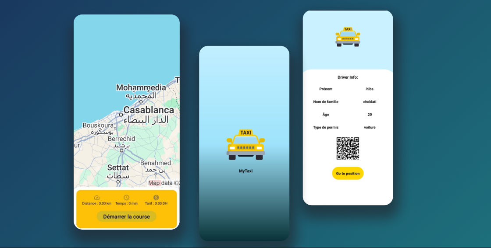

# MyTaxi 🚖

 <!-- Remplacez "./cover.jpg" par le chemin ou l'URL de votre image -->

**MyTaxi** est une application mobile Android développée en Kotlin permettant de simuler le fonctionnement d'un compteur de taxi. L'application calcule en temps réel la distance parcourue, le temps de trajet et le tarif de la course. Elle intègre également des fonctionnalités telles que le suivi en temps réel de la position du chauffeur sur Google Maps, la gestion des notifications, et un profil utilisateur interactif.

## Fonctionnalités ✨

- **Suivi en temps réel** 🗰️ de la position du chauffeur sur une carte Google Maps.
- **Calcul dynamique du tarif** 💸 basé sur la distance parcourue et le temps écoulé.
- **Notifications** 📲 envoyées à la fin de la course avec le récapitulatif du trajet (distance, temps et tarif).
- **QR Code** 🖼️ pour partager les informations du chauffeur avec les passagers.
- **Interface utilisateur** simple avec l'affichage de la distance, du temps et du montant de la course.
- **Gestion des permissions** 🔐 pour la localisation et les notifications à l'exécution.
- **Multilingue** 🌍 : Application disponible en français, anglais et arabe.

## Technologies utilisées ⚙️

- **Kotlin** 🦸 pour le développement de l'application Android.
- **Google Maps SDK** 🗰️ pour afficher la carte et la position du chauffeur en temps réel.
- **Firebase Cloud Messaging** 📬 pour l'envoi de notifications.
- **EasyPermissions** 🔑 pour gérer les permissions de localisation.
- **QR Code** 📱 généré pour le profil utilisateur.

## Installation 🛠️

### Prérequis 📋

- Android Studio (version 4.1 ou supérieure).
- Un émulateur Android ou un appareil physique pour tester l'application.

### Étapes d'installation ⚡

1. Clonez le repository :
   ```bash
   git clone https://github.com/votre_utilisateur/mytaxi.git
   ```

2. Ouvrez le projet dans Android Studio.

3. Configurez vos **clé API Google Maps** 🔑 en suivant les instructions de la documentation officielle [Google Maps SDK for Android](https://developers.google.com/maps/documentation/android-sdk/get-api-key).

4. Exécutez l'application sur un émulateur ou un appareil Android réel.

## Utilisation 🚀

1. **Démarrage de la course** 🎮 : Appuyez sur le bouton "Démarrer la course" pour commencer à suivre la position du chauffeur et calculer le tarif.
2. **Terminer la course** 🏁 : Lorsque la course est terminée, appuyez sur le même bouton pour voir la notification de fin de course avec le récapitulatif.
3. **Afficher le profil du chauffeur** 👤 : Cliquez sur l'icône de l'utilisateur pour accéder aux informations du chauffeur et scanner son QR Code.

## Contributions 🤝

Les contributions sont les bienvenues ! Si vous avez des suggestions ou des corrections, n'hésitez pas à ouvrir une **issue** ou à soumettre une **pull request**.

